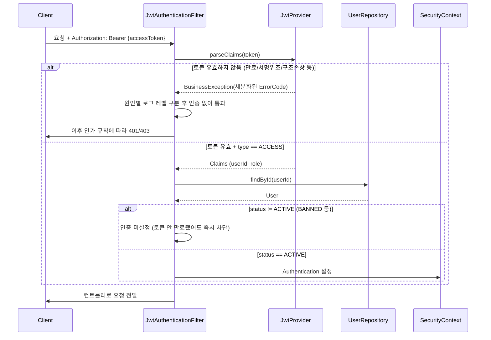
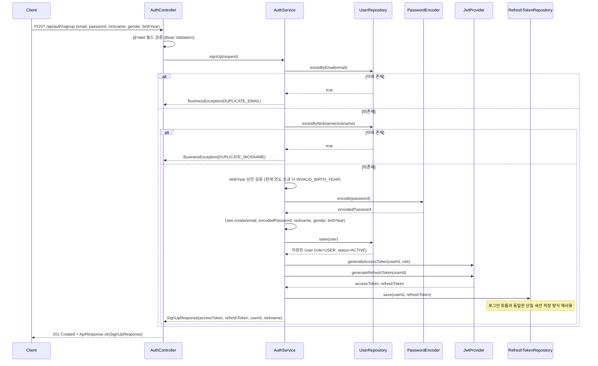
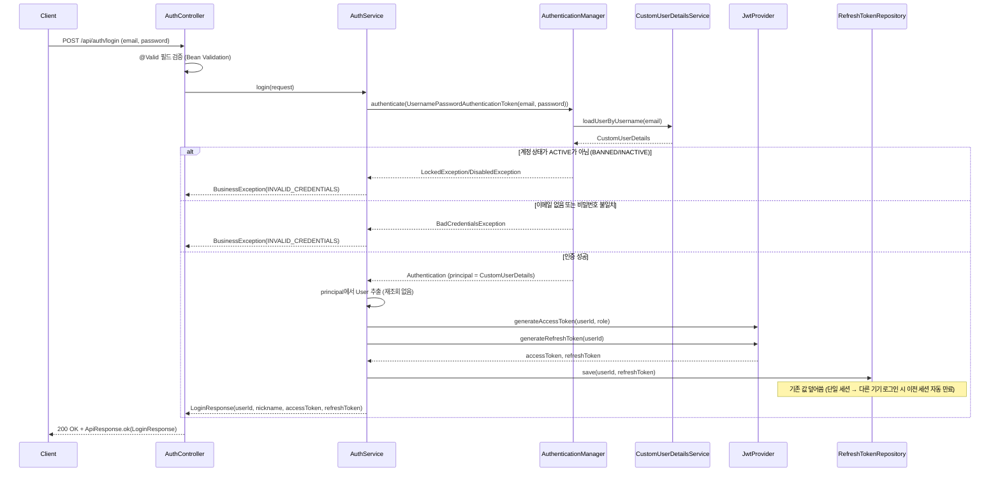
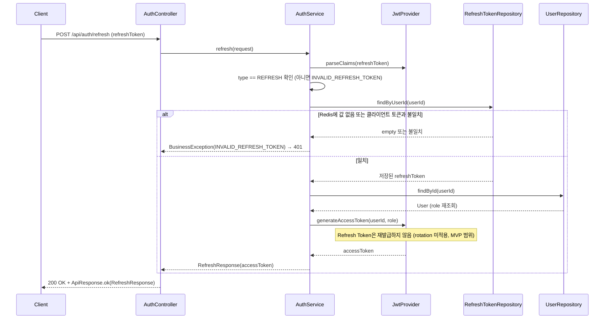
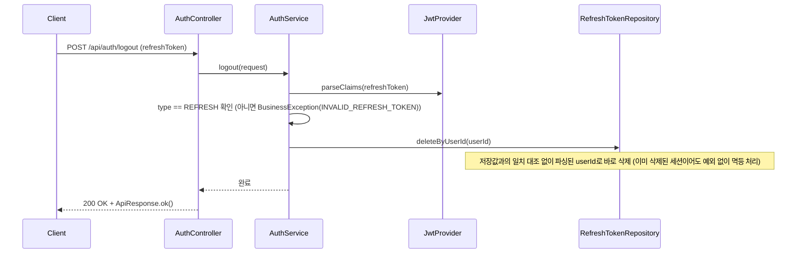
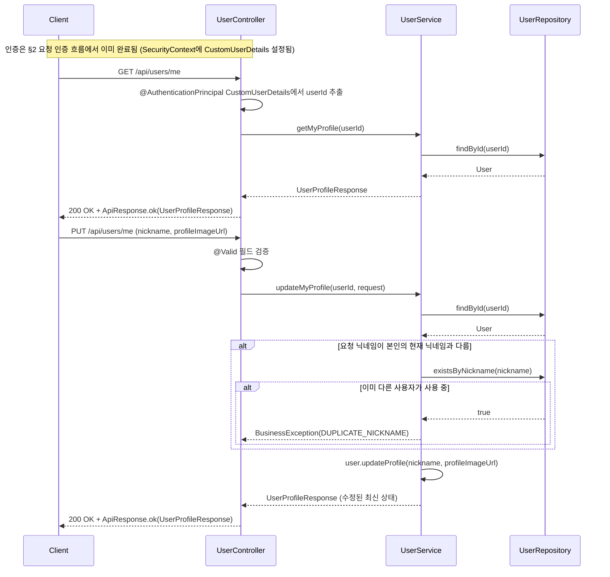

# 인증 아키텍처

> Phase 1: 인증 및 사용자 관리
> 서비스 초기 단계라 세부 구현(패키지 구조, 필드 설계 등)은 변경이 잦으므로 기록하지 않는다.
> 이 문서는 "왜 이런 구조를 선택했는지"와 "인증 흐름이 어떻게 동작하는지"만 정리한다.

---

## 1. 개요

JWT 기반 Stateless 인증. 서버는 세션을 유지하지 않고, 매 요청마다 클라이언트가 보낸 Access Token을 검증해 인증 여부를 판단한다.

| 구분 | 값 |
|------|-----|
| Access Token 만료 | 30분 |
| Refresh Token 만료 | 14일 |
| 서명 알고리즘 | HS256 |
| Refresh Token 저장소 | Redis, key `refresh:{userId}` (사용자당 1개, 단일 세션) |

**현재 구현 범위:** User 도메인, Spring Security 필터 체인, JWT 발급/검증 인프라(`JwtProvider`, `JwtAuthenticationFilter`, Refresh Token Redis 저장소), 회원가입/로그인/토큰 재발급/로그아웃/프로필 조회·수정 API까지 전부 구현 완료 (Phase 1 전체 완료, PR #3·#4·#7·#8·#9).

---

## 2. 요청 인증 흐름 (현재 구현됨)

모든 API 요청은 Spring Security 필터 체인을 통과하며, `JwtAuthenticationFilter`가 Access Token을 검증해 인증 정보를 설정한다.

**설계 포인트**

| 항목 | 결정 | 이유 |
|------|------|------|
| 인증 시 사용자 조회 | 매 요청마다 `userId`로 DB 조회 후 `CustomUserDetails` 생성 | 토큰 claim만으로 인증 객체를 만들면 BAN된 사용자가 Access Token 만료 전까지 계속 요청 가능해짐. DB 조회 비용은 MVP 단계에서 감수 |
| 토큰 검증 실패 처리 | 원인별 `ErrorCode` 세분화 (`EXPIRED_TOKEN`, `MALFORMED_TOKEN`, `INVALID_TOKEN_SIGNATURE`, `UNSUPPORTED_TOKEN`, `EMPTY_TOKEN`, `INVALID_TOKEN`) | 단순 boolean 반환은 서명 위조 시도와 단순 만료를 구분 못 해 보안 로그/모니터링에 불리함. 만료·빈 토큰은 `DEBUG`(정상 흐름), 위변조 의심 케이스는 `WARN` |
| 필터 실패 시 응답 | 예외를 던지지 않고 인증 미설정 상태로 다음 필터 통과 | `@RestControllerAdvice`는 필터 단계 예외를 못 잡으므로, 인증 실패는 이후 `authorizeHttpRequests` 규칙이 401/403으로 자연스럽게 처리하도록 위임 |

---

## 3. 회원가입 흐름 (구현 완료)

`POST /api/auth/signup`. 가입 성공 시 로그인 흐름과 동일하게 Access/Refresh Token을 즉시 발급하는 **자동 로그인** 방식을 채택한다.

**설계 포인트**

| 항목 | 결정 | 이유 |
|------|------|------|
| 가입 성공 시 처리 | 자동 로그인 (Access/Refresh Token 즉시 발급) | 로그인 흐름의 토큰 발급 로직(`JwtProvider`, `RefreshTokenRepository`)을 그대로 재사용. 가입 직후 별도 로그인 호출 없이 서비스 이용 가능 |
| 패키지 위치 | 신규 `auth` 패키지 (`controller`/`service`/`dto`) | 인증 관련 API를 `user`(도메인 CRUD)와 분리. 이후 로그인/재발급/로그아웃 API도 이 패키지에 추가 |
| `User` 생성 경로 | `User` 엔티티에 `public static User create(...)` 팩토리 메서드 추가 | 기존 `@Builder`는 생성자가 private이라 `user.domain` 패키지 밖에서 호출 불가(의도된 캡슐화). 팩토리 메서드로 `role=USER`/`status=ACTIVE` 강제 로직을 유지한 채 `auth.service`에서 생성 가능하게 함 |
| 비밀번호 정책 | 길이만 검증 (`@Size(min=8, max=20)`) | MVP 단계. 복잡도 규칙(영문/숫자/특수문자 조합)은 이후 필요 시 추가 |
| 이메일/닉네임 중복 검증 | 서비스 레이어에서 `existsByEmail`/`existsByNickname` 사전 체크 → DB unique 제약(`uk_users_email`, `uk_users_nickname`)은 동시 요청 레이스 컨디션 대비 최종 방어선 | 사전 체크로 더 명확한 에러 메시지 제공, DB 제약 위반(`DataIntegrityViolationException`)까지는 이번 스코프에서 별도 처리하지 않음(발생 확률 낮은 엣지케이스로 간주) |
| 출생연도 검증 | DTO에 `@Min(1900)`, 상한선(현재 연도 초과 금지)은 서비스 레이어에서 `LocalDate.now().getYear()` 기준으로 동적 검증 | Bean Validation 어노테이션은 컴파일타임 상수만 지원해 "현재 연도"라는 동적 상한을 표현할 수 없음 |
| 신규 `ErrorCode` | `DUPLICATE_EMAIL`(409), `DUPLICATE_NICKNAME`(409), `INVALID_BIRTH_YEAR`(400) 추가 | 기존 `ErrorCode`에 User 도메인 관련 그룹이 없음 |
| 이메일 인증(발송) | 범위 밖 (MVP 제외) | `spring-boot-starter-mail`은 배치 실패 알림 용도로 이미 계획돼 있어 회원가입 인증 메일과 무관. 필요 시 이후 단계에서 별도 설계 |

**알려진 기존 한계 (이번 스코프에서 손대지 않음)**

`GlobalExceptionHandler`에 `HttpMessageNotReadableException`(잘못된 JSON, `gender`에 정의되지 않은 값 등) 전용 핸들러가 없어 현재는 500(`INTERNAL_SERVER_ERROR`)으로 처리된다. 회원가입뿐 아니라 모든 API에 공통되는 기존 인프라의 갭이라 이번 작업 범위에 포함하지 않는다.

---

## 4. 로그인 흐름 (구현 완료)

`POST /api/auth/login`. `AuthenticationManager`/`CustomUserDetailsService`/`JwtProvider`/`RefreshTokenRepository` 등 필요한 인프라는 Phase 1에서 이미 구축되어 있어, `AuthController`/`AuthService`에 엔드포인트 로직만 추가하면 된다.

**설계 포인트**

| 항목 | 결정 | 이유 |
|------|------|------|
| 인증 실패 예외 변환 위치 | `AuthService.login()` 내부에서 `BadCredentialsException`/`LockedException`/`DisabledException`을 catch해 `BusinessException(INVALID_CREDENTIALS)`로 변환 | `JwtProvider.parseClaims()`가 JWT 라이브러리 예외를 잡아 `BusinessException`으로 바꾸는 기존 패턴과 일관성 유지. `GlobalExceptionHandler`에 Spring Security 예외 핸들러를 별도로 추가하지 않음 |
| 계정 상태(BANNED/INACTIVE) 노출 여부 | 별도 에러 코드로 구분하지 않고 `INVALID_CREDENTIALS`로 통일 | 이메일 존재 여부·계정 상태를 외부에 노출하지 않는 보안 관점 우선. `DaoAuthenticationProvider`가 이메일 없음/비밀번호 불일치를 이미 `BadCredentialsException`으로 통일하는 것과 동일한 기조 |
| 신규 `ErrorCode` | `INVALID_CREDENTIALS`(401) 1개만 추가 | 위 결정에 따라 로그인 실패 원인을 세분화하지 않음 |
| 응답 DTO | `SignUpResponse`를 재사용하지 않고 신규 `LoginResponse` 생성 (필드는 동일: `userId`, `nickname`, `accessToken`, `refreshToken`) | Swagger 문서상 의미가 다르고(가입 vs 로그인), 이후 두 흐름의 응답 필드가 갈라질 가능성 대비 |
| 사용자 조회 방식 | `Authentication.getPrincipal()`에서 얻은 `CustomUserDetails`를 그대로 사용 | `AuthenticationManager.authenticate()`가 내부적으로 `CustomUserDetailsService`를 이미 호출하므로 `UserRepository`를 또 조회할 필요 없음 |

---

## 5. 토큰 재발급 흐름 (구현 완료)

---

## 6. 로그아웃 흐름 (구현 완료)

---

## 7. 내 프로필 조회/수정 흐름 (구현 완료)

`GET/PUT /api/users/me`. `user` 패키지의 최초 API 구현이며, `controller`/`service`/`dto` 서브패키지를 신설한다.

**설계 포인트**

| 항목 | 결정 | 이유 |
|------|------|------|
| 사용자 식별 방식 | `@AuthenticationPrincipal CustomUserDetails`로 SecurityContext에서 `userId` 추출 | 로그아웃/재발급은 body의 `refreshToken`을 파싱해 `userId`를 얻지만, 이 API는 Access Token으로 인증하는 일반 API라 `JwtAuthenticationFilter`가 이미 채워둔 SecurityContext를 그대로 쓰는 것이 자연스러움. 코드베이스에서 `@AuthenticationPrincipal`을 쓰는 최초 사례 |
| 수정 가능 필드 | `nickname`, `profileImageUrl`만 (email/password/gender/birthYear 불가) | `User.updateProfile(nickname, profileImageUrl)`이 이미 이 두 필드만 변경하도록 설계돼 있음. 나머지 필드는 엔티티에 변경 메서드 자체가 없음 |
| 요청 DTO에 `userId` 미포함 | `userId`는 요청 body가 아니라 인증된 토큰에서만 얻음 | body로 `userId`를 받으면 클라이언트가 임의의 `userId`를 실어 보내 남의 프로필을 수정하는 IDOR 취약점이 생김 |
| 본인 현재 닉네임과 동일한 값으로 수정 | 중복 체크(`existsByNickname`)를 건너뜀 | `existsByNickname`은 본인 레코드도 "이미 존재"로 판단하므로, 그대로 쓰면 닉네임을 바꾸지 않고 다시 저장하는 요청도 항상 실패함 |
| 신규 `ErrorCode` | 없음, 기존 `DUPLICATE_NICKNAME`/`NOT_FOUND` 재사용 | 회원가입 때 쓰던 코드와 의미가 동일해 재사용으로 충분 |
| 응답 DTO | GET/PUT 모두 `UserProfileResponse` 하나로 통일 | PUT 응답에도 수정된 최신 프로필을 그대로 돌려줘 클라이언트가 재조회할 필요 없게 함. 비밀번호는 `LoginResponse` 선례와 동일하게 응답에서 제외 |

---

## 8. 컴포넌트 역할

| 컴포넌트 | 역할 |
|----------|------|
| `User` | 인증 주체 도메인. 이메일/비밀번호(BCrypt)/닉네임/권한(role)/상태(status)를 가짐. `create(...)` 정적 팩토리로만 외부 생성 가능 |
| `CustomUserDetails` | `User`를 Spring Security의 `UserDetails`로 감싸는 어댑터 (도메인이 Security에 직접 종속되지 않도록 분리) |
| `CustomUserDetailsService` | 이메일로 `User`를 조회해 `CustomUserDetails`로 변환 |
| `JwtProvider` | 토큰 발급(`generateAccessToken`/`generateRefreshToken`) 및 검증(`parseClaims`) 담당 |
| `JwtProperties` | `jwt.*` yml 설정을 `@ConfigurationProperties` + `@Validated`로 타입 안전하게 바인딩 (기동 시점에 값 누락/음수 만료시간 검증) |
| `JwtAuthenticationFilter` | 매 요청마다 Access Token을 검증해 `SecurityContext`에 인증 정보 설정 |
| `RefreshTokenRepository` | Redis 기반 Refresh Token 저장소 (`refresh:{userId}` 단일 세션) |
| `SecurityConfig` | 필터 체인 조립 + URI별 접근 제어 규칙 정의 |
| `AuthController` *(신규)* | `/api/auth/**` 엔드포인트 노출. 요청 DTO `@Valid` 검증 후 `AuthService` 위임 |
| `AuthService` *(신규)* | 회원가입/로그인/재발급/로그아웃 비즈니스 로직. 중복 검증, 비밀번호 인코딩, 토큰 발급 오케스트레이션 |
| `UserController` *(신규)* | `/api/users/me` 엔드포인트 노출. `@AuthenticationPrincipal`로 인증 사용자 식별 후 `UserService` 위임 |
| `UserService` *(신규)* | 내 프로필 조회/수정 비즈니스 로직. 닉네임 중복 검증(본인 값 제외) |

---

## 9. 접근 제어 매트릭스

| URI 패턴 | GET | POST | PUT | DELETE |
|----------|-----|------|-----|--------|
| `/api/auth/**` | 허용 | 허용 | 허용 | 허용 |
| `/api/recipes/**` | 허용 | 인증 | 인증 | 인증 |
| `/api/foods/**` | 허용 | 인증 | 인증 | 인증 |
| `/api/users/me/**` | 인증 | 인증 | 인증 | 인증 |
| `/api/admin/**` | ADMIN | ADMIN | ADMIN | ADMIN |
| `/v3/api-docs/**`, `/swagger-ui/**` | 허용 | — | — | — |

---

## 10. 그 외 아키텍처 결정

| 항목 | 결정 | 이유 |
|------|------|------|
| CSRF | `disable()` | Stateless JWT 방식에서는 세션 쿠키가 없으므로 CSRF 공격 벡터가 없음 |
| Session | `STATELESS` | 서버 세션 미사용, JWT로 상태 관리 |
| Refresh Token rotation | 미적용 (재발급 시 Access Token만 새로 발급) | 구현 단순화를 위한 MVP 범위 결정. 필요 시 이후 확장 |
| Secret 관리 | local은 yml에 직접 기재, prod는 `${JWT_SECRET}` 환경변수 | 기존 DB 접속 정보(`DB_URL` 등)와 동일한 패턴 |
| `UserDetails` 구현 | `User`가 직접 구현하지 않고 어댑터(`CustomUserDetails`)로 분리 | 도메인 객체를 Spring Security에 종속시키지 않기 위함 |
