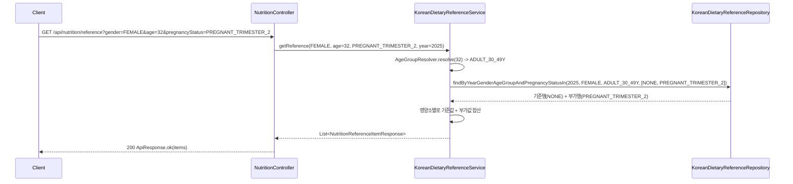
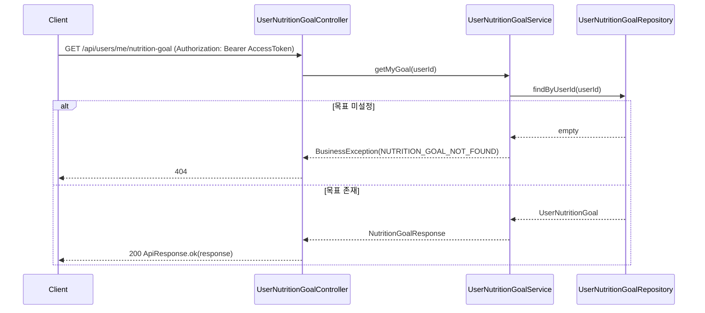
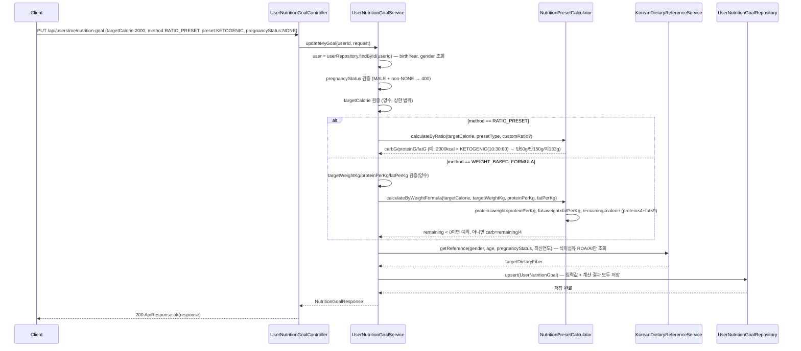
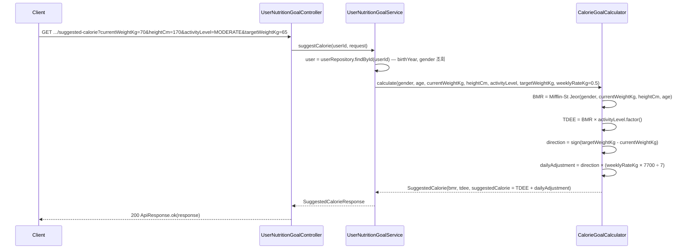

# 영양소 섭취기준 + 목표 설정 스펙 (Phase 2)

> 대상: `KoreanDietaryReference`(참조 테이블) + `UserNutritionGoal`(사용자 목표) + 관련 API 4종
> 참고자료: 루트 `2025_영양소_섭취기준_대비표(2020년_대비).pdf`, `backend/docs/product/research.md`(2026-07-30)
> 전제: research.md §5에서 확정된 스코프(영양소 20종, 임신부/수유부 부가량 포함, 2020·2025 버전 동시 보관)를 따른다.
> 2026-07-30 추가 확정(사용자): 참조 데이터 적재는 `data.sql`이 아닌 **Flyway 마이그레이션**으로 전환(§4), 신체정보(키/체중)·임신상태는 `UserNutritionGoal`에 저장(§1.4, §1.6), 2020↔2025 비교는 전용 API 없이 프론트에서 `referenceYear`를 바꿔 2번 조회.
> 2026-07-31 구현 중 변경(사용자 확정, `feat/nutrition-reference-api`):
> - §1.2/§1.3/§2.1: 영아(0-11개월) 구간을 조회 API에서도 지원하도록 `AgeGroupResolver.resolve(int ageYears, Integer ageInMonths)`로 시그니처 확장. `GET /api/nutrition/reference`에 `ageInMonths`(선택) 파라미터 추가 — `age`가 0일 때만 참고해 0-5개월/6-11개월을 구분. `age`가 1 이상이면 기존 로직 그대로.
> - `AgeGroupResolver`는 정적 유틸(§1.3 원안)이 아니라 `@Component`로 구현 — 코드베이스의 생성자 주입 컨벤션과 일치시키고 `KoreanDietaryReferenceServiceTest`에서 목(mock) 처리 가능하도록 함.
> - §1.1 `KoreanDietaryReference.value` 컬럼은 `value`가 H2 등 일부 DB의 예약어라 `reference_value`로 매핑(엔티티 필드/게터명은 `value` 유지, DB 컬럼명만 변경). V1의 `users` 테이블명 회피와 동일한 이유.

---

## 0. 개요

이번 Phase에서 다루는 영양소는 다음 20종으로 한정한다 (research.md §5.1 확정 — 다량영양소 5 + 비타민 10 + 무기질 5).

| 분류 | 영양소 |
|---|---|
| 다량영양소 | 에너지, 탄수화물, 단백질, 지방, 식이섬유 |
| 비타민 | A, B1(티아민), B2(리보플라빈), B3(니아신), B6, B9(엽산), B12, C, D, E |
| 무기질 | 칼슘, 나트륨, 칼륨, 마그네슘, 철 |

필수아미노산 9종, 콜린, 그 외 미량 무기질(아연/구리/요오드/셀레늄/망간/크롬/몰리브덴/불소/인/염소), 지방산 세부 항목, 수분은 이번 스코프에서 제외하고 향후 확장한다. 스키마는 영양소를 고정 컬럼이 아니라 `nutrient_code` 행으로 관리해 확장 시 스키마 변경이 필요 없도록 설계한다(§1.1).

---

## 1. 데이터 모델

### 1.1 `KoreanDietaryReference` (참조 테이블)

```java
@Entity
@Table(
    name = "korean_dietary_reference",
    uniqueConstraints = @UniqueConstraint(columnNames = {
        "reference_year", "gender", "age_group", "pregnancy_status", "nutrient_code", "indicator_type"
    })
)
@Getter
@NoArgsConstructor(access = AccessLevel.PROTECTED)
public class KoreanDietaryReference extends BaseEntity {

    @Id
    @GeneratedValue(strategy = GenerationType.IDENTITY)
    private Long id;

    @Column(name = "reference_year", nullable = false)
    private int referenceYear;            // 2020 또는 2025 (향후 2026, 2027 확장 가능)

    @Enumerated(EnumType.STRING)
    @Column(nullable = false)
    private Gender gender;                 // user.domain.Gender 재사용 (MALE/FEMALE)

    @Enumerated(EnumType.STRING)
    @Column(name = "age_group", nullable = false)
    private AgeGroup ageGroup;

    @Enumerated(EnumType.STRING)
    @Column(name = "pregnancy_status", nullable = false)
    private PregnancyStatus pregnancyStatus; // NONE / PREGNANT_T1~T3 / LACTATING (§1.4)

    @Enumerated(EnumType.STRING)
    @Column(name = "nutrient_code", nullable = false)
    private NutrientCode nutrientCode;

    @Enumerated(EnumType.STRING)
    @Column(name = "indicator_type", nullable = false)
    private IndicatorType indicatorType;   // EAR/RDA/AI/UL

    @Column(nullable = false, precision = 10, scale = 3)
    private BigDecimal value;              // 부가량 행(NONE이 아닌 경우)은 "가산값"만 저장
}
```

**설계 포인트**

| 항목 | 결정 | 이유 |
|---|---|---|
| 영양소를 컬럼이 아닌 행(`nutrient_code`)으로 관리 | 확정 | 아미노산 9종 등 향후 확장 시 스키마 변경 없이 데이터만 추가 가능 |
| `gender` 타입 | `user.domain.Gender` 재사용 (신규 enum 생성 안 함) | 영아/유아 구간은 남녀 공통 값이라 실제로는 `MALE`/`FEMALE` 행에 **동일 값을 중복 저장**한다. 3번째 값(`COMMON`)을 추가하는 대신 중복 저장을 택해 조회 로직을 항상 "성별 필수 조건"으로 단순하게 유지 |
| 임신부/수유부 값을 **가산값**으로 저장 | 확정 | 원본 대비표 표기 방식과 일치. 조회 시 `FEMALE + 해당 연령대 + NONE` 기준값에 가산값을 더하는 서비스 로직이 필요(§2.2) |
| `referenceYear`를 복합 유니크 키에 포함 | 확정 | 2020/2025 동시 보관 + 향후 연도 확장을 위한 필수 조건(research.md §5.3) |

### 1.2 `AgeGroup` (enum)

```java
public enum AgeGroup {
    INFANT_0_5M, INFANT_6_11M,
    TODDLER_1_2Y, TODDLER_3_5Y,
    CHILD_6_8Y, CHILD_9_11Y,
    ADOLESCENT_12_14Y, ADOLESCENT_15_18Y,
    ADULT_19_29Y, ADULT_30_49Y, ADULT_50_64Y,
    SENIOR_65_74Y, SENIOR_75_PLUS
}
```

**알려진 한계**: `User.birthYear`는 연 단위만 저장하므로 만 나이는 계산 가능하지만, 영아 구간(0-5개월 vs 6-11개월)은 월 단위 구분이 불가능하다. 이번 앱의 실사용자는 회원가입이 가능한 연령(사실상 성인~청소년)이므로, 사용자 기반 조회(`AgeGroupResolver`, §1.3)는 만 1세 이상만 정확히 지원하고 영아 두 구간은 `GET /api/nutrition/reference/all`(전체 조회, 특정 사용자에 종속되지 않음)에서만 데이터로 노출한다. 이는 스코프상 의도된 단순화이며 별도 승인 없이 진행하되, 플랜 리뷰 시 이견 있으면 조정 가능하다.

### 1.3 나이 → `AgeGroup` 변환 (2026-07-31 구현 중 변경 반영, 상단 안내 참고)

`age`가 0일 때만 `ageInMonths`를 참고해 영아 두 구간(0-5개월/6-11개월)을 구분한다. 코드베이스의 생성자 주입 컨벤션과 일치시키고 테스트에서 목(mock) 처리 가능하도록 정적 유틸이 아닌 `@Component`로 구현한다.

```java
@Component
public class AgeGroupResolver {
    public AgeGroup resolve(int ageYears, Integer ageInMonths) {
        if (ageYears == 0) {
            int months = ageInMonths != null ? ageInMonths : 0;
            return months <= 5 ? AgeGroup.INFANT_0_5M : AgeGroup.INFANT_6_11M;
        }
        if (ageYears <= 2) return AgeGroup.TODDLER_1_2Y;
        if (ageYears <= 5) return AgeGroup.TODDLER_3_5Y;
        if (ageYears <= 8) return AgeGroup.CHILD_6_8Y;
        if (ageYears <= 11) return AgeGroup.CHILD_9_11Y;
        if (ageYears <= 14) return AgeGroup.ADOLESCENT_12_14Y;
        if (ageYears <= 18) return AgeGroup.ADOLESCENT_15_18Y;
        if (ageYears <= 29) return AgeGroup.ADULT_19_29Y;
        if (ageYears <= 49) return AgeGroup.ADULT_30_49Y;
        if (ageYears <= 64) return AgeGroup.ADULT_50_64Y;
        if (ageYears <= 74) return AgeGroup.SENIOR_65_74Y;
        return AgeGroup.SENIOR_75_PLUS;
    }
}
```

### 1.4 `PregnancyStatus` (enum) — 저장 위치는 `UserNutritionGoal` (User 엔티티는 변경하지 않음)

> **구현 중 정정 (2026-08-01):** 이 enum의 실제 자바 패키지 위치는 `goal.domain`이 아니라 **`nutrition.domain`**이다. `KoreanDietaryReference`(§1.1)가 먼저 이 값을 필요로 해 그 패키지에 구현되었고, 이후 `UserNutritionGoal`도 이를 재사용했다. 아래 "저장 위치는 UserNutritionGoal"이라는 표현은 *테이블(값이 어디에 저장되는지)* 기준이며, *자바 패키지* 기준이 아니므로 혼동하지 말 것.

```java
public enum PregnancyStatus {
    NONE, PREGNANT_TRIMESTER_1, PREGNANT_TRIMESTER_2, PREGNANT_TRIMESTER_3, LACTATING
}
```

**설계 포인트 (research.md §5.2 관련 결정)**

| 항목 | 결정 | 이유 |
|---|---|---|
| 임신/수유 상태를 어디에 저장할지 | `User` 엔티티가 아니라 **`UserNutritionGoal`에 저장** | 이 상태는 영양 목표 계산에만 쓰이는 값이라, 굳이 Phase 1에서 완성된 `User` 엔티티·프로필 API(`PUT /api/users/me`)를 건드릴 필요가 없다. 기존 코드 변경 범위를 최소화하고 CLAUDE.md의 "기존 시스템 로직을 무시하는 중복 구현 경계" 원칙과도 부합 |
| `FEMALE`이 아닌데 `NONE`이 아닌 값 설정 시도 | `BusinessException(INVALID_PREGNANCY_STATUS)` (400) | `user.getGender()`가 `MALE`이면 임신/수유 상태가 의미 없으므로 서비스 계층에서 검증 |

### 1.5 `NutrientCode` / `IndicatorType` (enum)

```java
public enum NutrientCode {
    ENERGY, CARBOHYDRATE, PROTEIN, FAT, DIETARY_FIBER,
    VITAMIN_A, VITAMIN_B1, VITAMIN_B2, VITAMIN_B3, VITAMIN_B6, VITAMIN_B9, VITAMIN_B12, VITAMIN_C, VITAMIN_D, VITAMIN_E,
    CALCIUM, SODIUM, POTASSIUM, MAGNESIUM, IRON
}

public enum IndicatorType { EAR, RDA, AI, UL }
```

단위(unit, kcal/g/mg/µg)는 저장하지 않고 `NutrientCode`에서 정적으로 매핑한다(예: `NutrientCode.ENERGY.unit() == "kcal"`) — 영양소당 단위는 고정값이라 행마다 중복 저장할 이유가 없음.

### 1.6 `UserNutritionGoal`

목표 칼로리는 **기본값을 KDRI 필요추정량(EER)으로 클라이언트가 미리 채워주고, 사용자가 자유롭게 수정한 최종값을 서버에 그대로 전달**하는 구조다(서버가 내부적으로 EER을 다시 계산해 덮어쓰지 않음 — §2.4 참고). 매크로(탄/단/지)는 이 목표 칼로리가 정해진 **이후에** 두 가지 계산 방식 중 하나로 산출한다(§3).

```java
@Entity
@Table(name = "user_nutrition_goal", uniqueConstraints = @UniqueConstraint(columnNames = "user_id"))
@Getter
@NoArgsConstructor(access = AccessLevel.PROTECTED)
public class UserNutritionGoal extends BaseEntity {

    @Id
    @GeneratedValue(strategy = GenerationType.IDENTITY)
    private Long id;

    @Column(name = "user_id", nullable = false, unique = true)
    private Long userId;                   // 관계 매핑 없이 순수 FK 컬럼 (User 애그리거트와 분리, 기존 코드 스타일과 일치)

    @Enumerated(EnumType.STRING)
    @Column(name = "pregnancy_status", nullable = false)
    private PregnancyStatus pregnancyStatus;

    @Column(name = "reference_year", nullable = false)
    private int referenceYear;             // 식이섬유 목표 산출에 사용한 KDRI 버전 (추적용, research.md §5.3)

    @Column(name = "target_calorie", nullable = false, precision = 10, scale = 2)
    private BigDecimal targetCalorie;      // 기본값 KDRI EER, 사용자가 직접 수정 가능

    @Enumerated(EnumType.STRING)
    @Column(name = "macro_calculation_method", nullable = false)
    private MacroCalculationMethod macroCalculationMethod; // RATIO_PRESET / WEIGHT_BASED_FORMULA

    @Enumerated(EnumType.STRING)
    @Column(name = "macro_preset_type")
    private MacroPresetType macroPresetType;   // method == RATIO_PRESET일 때만 사용

    @Column(name = "height_cm", precision = 6, scale = 2)
    private BigDecimal heightCm;            // 목표 칼로리 자동 제안(BMR) 계산에 사용, §2.5/§3.0

    @Column(name = "current_weight_kg", precision = 6, scale = 2)
    private BigDecimal currentWeightKg;     // 목표 칼로리 자동 제안(BMR) 계산에 사용

    @Column(name = "target_weight_kg", precision = 6, scale = 2)
    private BigDecimal targetWeightKg;      // 목표 칼로리 자동 제안 + method == WEIGHT_BASED_FORMULA(매크로) 둘 다 사용

    @Enumerated(EnumType.STRING)
    @Column(name = "activity_level")
    private ActivityLevel activityLevel;    // 목표 칼로리 자동 제안(TDEE) 계산에 사용, §1.8

    @Column(name = "weekly_rate_kg", precision = 4, scale = 2)
    private BigDecimal weeklyRateKg;        // 주당 목표 체중 변화율, 기본값 0.5(kg/주), 사용자 수정 가능

    @Column(name = "protein_per_kg", precision = 5, scale = 2)
    private BigDecimal proteinPerKg;        // method == WEIGHT_BASED_FORMULA일 때 사용 (g/kg)

    @Column(name = "fat_per_kg", precision = 5, scale = 2)
    private BigDecimal fatPerKg;            // method == WEIGHT_BASED_FORMULA일 때 사용 (g/kg)

    // 아래 4개는 위 입력값 + NutritionPresetCalculator로 계산된 "최종 확정 목표치" (조회 시 재계산 없이 바로 응답)
    @Column(name = "target_carbohydrate", nullable = false, precision = 10, scale = 2)
    private BigDecimal targetCarbohydrate;
    @Column(name = "target_protein", nullable = false, precision = 10, scale = 2)
    private BigDecimal targetProtein;
    @Column(name = "target_fat", nullable = false, precision = 10, scale = 2)
    private BigDecimal targetFat;
    @Column(name = "target_dietary_fiber", nullable = false, precision = 10, scale = 2)
    private BigDecimal targetDietaryFiber; // KDRI RDA/AI에서 그대로 가져옴 (매크로 계산과 무관, 사용자 수정 대상 아님)
}
```

**설계 포인트**

| 항목 | 결정 | 이유 |
|---|---|---|
| 목표(target)를 다량영양소 5종에만 한정 (비타민/무기질 목표 없음) | 확정 | 비타민·무기질은 "권장섭취량 대비 얼마나 먹었는지" 비교 대상이지 사용자가 조정하는 다이어트 목표가 아님. 비타민/무기질은 항상 `KoreanDietaryReference`의 기준값을 그대로 노출 |
| `targetCalorie`는 서버가 저장 시점에 자동 계산하지 않고 클라이언트가 보낸 최종값을 그대로 저장 | 확정 | 사용자가 목표 칼로리 자체를 잘 모를 수 있어 두 가지 "제안" 경로를 둔다: (1) `GET /api/nutrition/reference`의 KDRI EER, (2) `GET /api/users/me/nutrition-goal/suggested-calorie`의 BMR/TDEE 기반 계산값(§2.5). 어느 쪽이든 **제안값을 폼에 미리 채우고 사용자가 수정한 최종값만 `PUT`으로 전송** — 서버는 "값 검증 + 저장"만 책임지고 계산 로직 중복을 피함 |
| `heightCm`/`currentWeightKg`/`activityLevel`/`weeklyRateKg` 필드 추가 | 확정 (사용자 요청) | 목표 칼로리 자동 제안(BMR/TDEE 기반, §2.5·§3.0)에 필요. `targetWeightKg`는 이 계산과 매크로 방식 B(§3.2) 양쪽에서 재사용됨 |
| `weeklyRateKg` 기본값 0.5(kg/주) | 확정 (사용자 요청) | 일반적으로 통용되는 "주당 0.5kg" 감량/증량 속도 가이드라인. 사용자가 값을 지정하면 그 값을 우선 사용 |
| `pregnancyStatus`를 `User`가 아닌 여기에 저장 | 확정 | §1.4 참고 |
| `User`와의 관계를 JPA `@OneToOne` 대신 `userId` 컬럼 | 확정 | 기존 코드베이스(`User`, `RefreshTokenRepository`)가 엔티티 간 JPA 연관관계를 쓰지 않고 ID 컬럼으로만 참조하는 스타일이라 일관성 유지 |
| 계산된 매크로 g 값을 입력값과 함께 저장(비정규화) | 확정 | 조회 API가 매번 재계산하지 않고 바로 응답할 수 있도록 계산 결과를 함께 영속화. 대신 입력값(비율/체중/계수)이 바뀌면 반드시 재계산 후 갱신해야 하는 책임이 서비스 계층에 생김(`update()`에서 항상 재계산) |

### 1.7 `MacroCalculationMethod` / `MacroPresetType` (enum)

```java
public enum MacroCalculationMethod { RATIO_PRESET, WEIGHT_BASED_FORMULA }

public enum MacroPresetType {
    ZONE(40, 30, 30),               // 존 다이어트
    KETOGENIC(10, 30, 60),          // 키토제닉
    LOW_FAT_HIGH_CARB(60, 20, 20),  // 저지방 고탄수
    WEIGHT_TRAINING(30, 40, 30),    // 웨이트 트레이닝
    CLASSIC_BULK(50, 30, 20),       // 클래식 벌크업
    LEAN_BULK(40, 40, 20),          // 린매스업
    CUSTOM(null, null, null);       // 비율 직접 선택 — 요청의 carbRatio/proteinRatio/fatRatio를 사용

    private final Integer carbRatio;
    private final Integer proteinRatio;
    private final Integer fatRatio;
    // 생성자/getter 생략
}
```

이 비율(탄:단:지)은 각 다이어트 방법론에서 흔히 통용되는 근사치이며, 의학적으로 처방된 고정값은 아니다. `CUSTOM` 선택 시 사용자가 3개 비율을 직접 입력하고 합이 100이어야 한다(§3 검증 규칙).

### 1.8 `ActivityLevel` (enum) — 목표 칼로리 자동 제안(TDEE 계산)에 사용

```java
public enum ActivityLevel {
    SEDENTARY(1.2),      // 좌식 생활, 운동 거의 안 함
    LIGHT(1.375),        // 가벼운 활동, 주 1-3회 가벼운 운동
    MODERATE(1.55),      // 보통 활동, 주 3-5회 운동
    ACTIVE(1.725),       // 활발한 활동, 주 6-7회 운동
    VERY_ACTIVE(1.9);    // 매우 활발한 활동, 매일 강도 높은 운동/육체노동

    private final double factor; // BMR에 곱해 TDEE(활동대사량) 산출
}
```

---

## 2. 흐름별 설계

### 2.1 영양소 기준값 단건 조회 — `GET /api/nutrition/reference` (구현 완료, 인증 불필요)

쿼리 파라미터: `gender`(MALE/FEMALE, 필수), `age`(int, 필수), `pregnancyStatus`(선택, 기본 NONE), `referenceYear`(선택, 기본 2025)



**설계 포인트**

| 항목 | 결정 | 이유 |
|---|---|---|
| 인증 불필요(permitAll) | 확정 | `/api/recipes/**`, `/api/foods/**` GET과 동일하게 공공 정보 성격 — 가족 구성원 등 타인 기준도 조회 가능해야 함 |
| `pregnancyStatus`가 `MALE`과 함께 들어오면 | `BusinessException(INVALID_PREGNANCY_STATUS)` (400) | §1.4와 동일 규칙을 조회 API에도 적용 |
| 데이터 없음(해당 연령대에 해당 영양소 지표가 없는 경우, 예: UL 없는 영양소) | 해당 지표만 `null`로 응답, 전체 404 처리하지 않음 | 원본 표 자체가 지표별로 존재 여부가 다름(§1.5) |

### 2.2 전체 연령대 기준값 조회 — `GET /api/nutrition/reference/all` (구현 완료, 인증 불필요)

쿼리 파라미터: `referenceYear`(선택, 기본 2025). 전체 성별×연령대×영양소 조합을 그대로 반환(그리드 형태, 프론트에서 표로 렌더링). 임신부/수유부 부가행도 별도 항목으로 포함해 응답.

### 2.3 내 영양 목표 조회 — `GET /api/users/me/nutrition-goal` (인증 필요)



**설계 포인트**: 목표를 자동 계산해 즉시 반환하지 않고 **미설정 시 404**로 응답한다 — "목표를 아직 설정 안 함"과 "설정된 목표"를 프론트에서 명확히 구분해 온보딩 플로우(최초 목표 설정 유도)를 트리거하기 쉽게 하기 위함.

### 2.4 내 영양 목표 설정 — `PUT /api/users/me/nutrition-goal` (인증 필요)

요청 바디 (`NutritionGoalUpdateRequest`):

| 필드 | 필수 여부 | 설명 |
|---|---|---|
| `targetCalorie` | 항상 필수 | 클라이언트가 `GET /api/nutrition/reference`에서 조회한 EER을 기본값으로 미리 채워 사용자에게 보여주고, 수정된 최종값을 그대로 전송. 서버는 재계산하지 않고 검증(양수, 상식적 범위)만 수행 |
| `pregnancyStatus` | 선택, 기본 `NONE` | `MALE`이면서 `NONE`이 아니면 400(`INVALID_PREGNANCY_STATUS`) |
| `macroCalculationMethod` | 필수 | `RATIO_PRESET` \| `WEIGHT_BASED_FORMULA` |
| `macroPresetType` | `method == RATIO_PRESET`일 때 필수 | 7종 중 하나 |
| `carbRatio`/`proteinRatio`/`fatRatio` | `macroPresetType == CUSTOM`일 때만 필수, 합계 100 | 그 외 프리셋일 땐 무시(서버가 §1.7 표에서 조회) |
| `heightCm`/`targetWeightKg` | `method == WEIGHT_BASED_FORMULA`일 때 필수 | `heightCm`은 저장만 함(계산 미사용) |
| `proteinPerKg`/`fatPerKg` | `method == WEIGHT_BASED_FORMULA`일 때 필수 | g/kg 단위, 사용자 직접 입력 |



**설계 포인트**

| 항목 | 결정 | 이유 |
|---|---|---|
| 목표 칼로리는 사용자가 최종 결정, 매크로 비율/공식은 칼로리를 바꾸지 않고 그램만 산출 | 확정 (사용자 지시) | 예: 목표 칼로리 2000kcal에서 키토제닉(10:30:60) 적용 시 탄수화물 50g·단백질 150g·지방 약 133g — 칼로리 자체는 그대로 2000kcal 유지 |
| 방식 B에서 `remaining < 0`(단백질+지방 칼로리가 목표 칼로리 초과) | `BusinessException(INVALID_NUTRITION_GOAL)` (400) | 탄수화물이 음수가 되는 것을 방지 |
| `CUSTOM` 비율의 합이 100이 아닌 경우 | `BusinessException(INVALID_NUTRITION_GOAL)` (400) | 비율 무결성 보장 |

### 2.5 목표 칼로리 자동 제안 — `GET /api/users/me/nutrition-goal/suggested-calorie` (구현 완료, 인증 필요)

사용자가 목표 칼로리를 얼마로 잡아야 할지 감이 없는 경우를 위한 **미리보기 전용** API. 아무것도 저장하지 않고 계산 결과만 반환한다 — 사용자는 이 값을 참고해 최종 `targetCalorie`를 정하고 §2.4의 `PUT`에 담아 보낸다.

쿼리 파라미터: `currentWeightKg`(필수), `heightCm`(필수), `activityLevel`(필수), `targetWeightKg`(필수), `weeklyRateKg`(선택, 기본 0.5)



**설계 포인트**

| 항목 | 결정 | 이유 |
|---|---|---|
| 저장하지 않는 조회 전용(GET) API로 분리 | 확정 | 목표 칼로리 확정 전 "미리보기"만 필요 — `PUT`과 책임을 분리해 사용자가 여러 번 시나리오를 바꿔가며 조회해봐도 부작용이 없음 |
| `targetWeightKg == currentWeightKg` (감량/증량 불필요) | `dailyAdjustment = 0` → `suggestedCalorie = TDEE` | 유지 목적으로 자연스럽게 수렴 |
| 1kg 체지방 ≈ 7700kcal 상수 | 근사값(문헌마다 7000~7700 범위로 다르게 인용) | 업계에서 흔히 쓰는 근사치를 채택. 정밀 의학적 계산이 아니라 "참고용 제안"이라는 점을 프론트 UI 문구에 명시 권장 |
| 인증 필요(`GET /api/nutrition/reference`와 달리 permitAll 아님) | 확정 | 나이·성별을 인증된 사용자(`User`)에서 가져와 재입력을 줄임 |

---

## 3. 목표 칼로리·매크로 계산 로직

### 3.0 `CalorieGoalCalculator` — 목표 칼로리 자동 제안 (§2.5)

```java
public SuggestedCalorie calculate(Gender gender, int age, BigDecimal currentWeightKg, BigDecimal heightCm,
                                   ActivityLevel activityLevel, BigDecimal targetWeightKg, BigDecimal weeklyRateKg) {
    BigDecimal bmr = gender == Gender.MALE
        ? TEN.multiply(currentWeightKg).add(SIX_25.multiply(heightCm)).subtract(FIVE.multiply(age)).add(FIVE)
        : TEN.multiply(currentWeightKg).add(SIX_25.multiply(heightCm)).subtract(FIVE.multiply(age)).subtract(ONE_SIXTY_ONE);
    BigDecimal tdee = bmr.multiply(BigDecimal.valueOf(activityLevel.factor()));

    int direction = targetWeightKg.compareTo(currentWeightKg); // -1 감량, 0 유지, +1 증량
    BigDecimal dailyAdjustment = direction == 0
        ? BigDecimal.ZERO
        : weeklyRateKg.multiply(KCAL_PER_KG_FAT).divide(SEVEN, ROUND).multiply(BigDecimal.valueOf(direction));

    return new SuggestedCalorie(bmr, tdee, tdee.add(dailyAdjustment));
}
```

(Mifflin-St Jeor 공식: 남성 `10×체중+6.25×키−5×나이+5`, 여성 `10×체중+6.25×키−5×나이−161`. `KCAL_PER_KG_FAT = 7700`.)

### 3.1 `NutritionPresetCalculator` — 매크로 계산 로직

목표 칼로리(`targetCalorie`)는 §2.4에서 이미 확정된 입력값이며(§2.5의 제안값이든 KDRI EER이든 사용자가 최종 수정한 값), 이 계산기는 **칼로리를 조정하지 않고** 그 칼로리를 탄/단/지 그램으로 분배하는 역할만 한다. 두 계산 방식 중 요청의 `macroCalculationMethod`에 따라 분기한다.

#### 3.1.1 방식 A — 비율 프리셋 (`RATIO_PRESET`)

```java
public NutritionTargets calculateByRatio(BigDecimal targetCalorie, MacroPresetType presetType,
                                          Integer customCarbRatio, Integer customProteinRatio, Integer customFatRatio) {
    Ratio ratio = presetType == MacroPresetType.CUSTOM
        ? Ratio.of(customCarbRatio, customProteinRatio, customFatRatio) // 합계 100 검증
        : Ratio.from(presetType); // §1.7 표에서 조회

    BigDecimal carbG = targetCalorie.multiply(ratio.carb()).divide(ONE_HUNDRED).divide(FOUR, ROUND);   // 4kcal/g
    BigDecimal proteinG = targetCalorie.multiply(ratio.protein()).divide(ONE_HUNDRED).divide(FOUR, ROUND);
    BigDecimal fatG = targetCalorie.multiply(ratio.fat()).divide(ONE_HUNDRED).divide(NINE, ROUND);      // 9kcal/g
    return new NutritionTargets(carbG, proteinG, fatG);
}
```

예: 목표 칼로리 2000kcal + `KETOGENIC`(10:30:60) → 탄수화물 200kcal÷4=**50g**, 단백질 600kcal÷4=**150g**, 지방 1200kcal÷9≈**133.3g**.

| 프리셋 | 탄:단:지 |
|---|---|
| ZONE (존 다이어트) | 40:30:30 |
| KETOGENIC (키토제닉) | 10:30:60 |
| LOW_FAT_HIGH_CARB (저지방 고탄수) | 60:20:20 |
| WEIGHT_TRAINING (웨이트 트레이닝) | 30:40:30 |
| CLASSIC_BULK (클래식 벌크업) | 50:30:20 |
| LEAN_BULK (린매스업) | 40:40:20 |
| CUSTOM (직접 선택) | 사용자 입력, 합계 100 검증 |

#### 3.1.2 방식 B — 체중 기반 공식 (`WEIGHT_BASED_FORMULA`)

```java
public NutritionTargets calculateByWeightFormula(BigDecimal targetCalorie, BigDecimal targetWeightKg,
                                                  BigDecimal proteinPerKg, BigDecimal fatPerKg) {
    BigDecimal proteinG = targetWeightKg.multiply(proteinPerKg);
    BigDecimal fatG = targetWeightKg.multiply(fatPerKg);
    BigDecimal usedKcal = proteinG.multiply(FOUR).add(fatG.multiply(NINE));
    BigDecimal remainingKcal = targetCalorie.subtract(usedKcal);
    if (remainingKcal.signum() < 0) {
        throw new BusinessException(ErrorCode.INVALID_NUTRITION_GOAL);
    }
    BigDecimal carbG = remainingKcal.divide(FOUR, ROUND);
    return new NutritionTargets(carbG, proteinG, fatG);
}
```

두 방식 모두 식이섬유(`targetDietaryFiber`)는 관여하지 않고, `KoreanDietaryReferenceService`가 조회한 해당 연령대·성별·임신상태의 RDA/AI 값을 그대로 사용한다(§2.4).

---

## 4. 데이터 시딩 — Flyway 마이그레이션

기존 스키마는 Hibernate `ddl-auto`로만 관리되어 왔다(로컬 `create-drop`, 운영 `validate`). 참조 데이터가 연도별로 계속 누적되는 구조라 Phase 2부터 **Flyway로 전환**한다(2026-07-30 사용자 결정 — CLAUDE.md 기준 "기술 스택 변경"에 해당해 사전 승인받음). `data.sql`은 쓰지 않는다.

### 4.1 의존성 (`backend/build.gradle.kts`)

```kotlin
// Flyway (DB 마이그레이션) — Spring Boot BOM이 버전 관리하므로 버전 명시 불필요
implementation("org.flywaydb:flyway-core")
implementation("org.flywaydb:flyway-database-postgresql")
```

### 4.2 공통 설정 (`application.yml`)

```yaml
spring:
  flyway:
    locations: classpath:db/migration
    baseline-on-migrate: true
    # baseline-version은 프로필별로 다름 (§4.3)
```

**`baseline-version`이 로컬/운영에서 왜 다른가**: 운영 DB는 이미 Hibernate가 만든 `users` 테이블이 실제로 존재하는 상태에서 Flyway를 처음 도입하는 것이라, 그 상태를 "버전 1까지는 이미 적용됨"으로 간주하고 베이스라인을 잡아야 `V1`(아래 §4.4, `users` 테이블 생성 DDL)이 다시 실행되어 `relation already exists` 오류가 나는 것을 막을 수 있다. 반면 로컬은 `ddl-auto: create-drop` 시절부터 재시작마다 스키마가 완전히 삭제되는 환경이라, Flyway 전환 후 첫 기동 시점엔 진짜 빈 DB이므로 `V1`부터 실제로 실행되어야 `users` 테이블이 만들어진다.

### 4.3 프로필별 변경

- `application-local.yml`: `ddl-auto: create-drop` → **`validate`** 로 변경, `spring.flyway.baseline-version: 0` 추가(§4.2) — 스키마 소유권을 완전히 Flyway로 이전.
- `application-prod.yml`: `ddl-auto: validate` 그대로 유지(변경 없음), `spring.flyway.baseline-version: 1` 추가(§4.2) — 기존 `users` 테이블에 대해 `V1`을 건너뛰도록.

### 4.4 마이그레이션 파일 (`backend/src/main/resources/db/migration/`)

| 파일 | 내용 |
|---|---|
| `V1__baseline_users_table.sql` | Flyway 도입 이전 Hibernate `ddl-auto`가 만들어 오던 `users` 테이블을 그대로 베이스라인으로 등록 (`chore/nutrition-flyway-setup`에서 작성 완료) |
| `V2__create_korean_dietary_reference_table.sql` | `korean_dietary_reference` 테이블 생성 DDL (§1.1 엔티티와 1:1 대응, 복합 유니크 제약 포함) — 참조값 조회 API 작업 단위(`feat/nutrition-reference-api`)에서 작성 |
| `V3__seed_korean_dietary_reference_2020.sql` | 2020년 기준 INSERT |
| `V4__seed_korean_dietary_reference_2025.sql` | 2025년 기준 INSERT |
| `V5__create_user_nutrition_goal_table.sql` | `user_nutrition_goal` 테이블 생성 DDL (§1.6 엔티티와 1:1 대응) — 목표 설정 API 작업 단위(`feat/nutrition-goal-api`)에서 작성 |

테이블 생성을 두 마이그레이션(V2, V5)으로 분리한 이유는 구현 작업 단위(브랜치)가 `nutrition`/`goal` 두 도메인으로 나뉘어 있어, 각 작업 단위가 자신이 필요한 테이블만 마이그레이션에 담는 것이 브랜치 경계와 일치하기 때문이다. 향후 개정판(예: 2030년) 추가 시 `V6__seed_korean_dietary_reference_2030.sql`처럼 새 버전 파일만 추가한다 — 이미 적용된 마이그레이션 파일은 절대 수정하지 않는다는 Flyway 원칙과, "연도별로 별도 행을 추가"하는 §1.1 설계가 자연스럽게 맞아떨어진다.

**⚠️ 리스크 (research.md §2.3 재확인)**: 이번 리서치에 쓰인 대비표 PDF는 텍스트 추출 시 셀 정렬이 일부 깨져 있어 정확한 셀 대응이 보장되지 않는다. `/implement` 단계에서 `V3`/`V4` 시딩 SQL 작성 시 보건복지부·한국영양학회의 공식 2020/2025 원본 표(이미지 또는 공식 배포 자료)를 직접 대조하며 사람이 입력해야 한다. 이 작업은 체크리스트에 "공식 원본 대조 필수" 항목으로 별도 명시한다(plan.md 참고).

### 4.5 Testcontainers와의 관계

Flyway 의존성이 클래스패스에 있으면 Spring Boot가 애플리케이션 컨텍스트 기동 시 자동으로 마이그레이션을 실행하므로, Testcontainers 기반 Repository 통합 테스트도 별도 설정 없이 항상 완전히 마이그레이션된 스키마 위에서 실행된다.

---

## 5. 컴포넌트 역할

| 컴포넌트 | 역할 |
|---|---|
| `KoreanDietaryReferenceRepository` | `(referenceYear, gender, ageGroup, pregnancyStatus IN (NONE, 요청상태))`로 조회하는 파생 쿼리 1~2개만 필요, QueryDSL 불필요 |
| `KoreanDietaryReferenceService` | 나이→AgeGroup 변환, 기준값+부가값 합산, 응답 DTO 조립 |
| `CalorieGoalCalculator` | Mifflin-St Jeor BMR + 활동계수 TDEE + 목표체중 변화율 기반 목표 칼로리 제안 (순수 계산 로직, §3.0) |
| `NutritionPresetCalculator` | 방식 A(비율 프리셋)/방식 B(체중 기반 공식)로 목표 칼로리를 탄/단/지 그램으로 분배 (순수 계산 로직, Repository 의존 없음 → 단위 테스트 용이) |
| `UserNutritionGoalService` | 사용자 조회, 임신상태 검증, 칼로리 제안/매크로 계산 위임, upsert |
| `NutritionController` | 공개 조회 API 2종 |
| `UserNutritionGoalController` | 인증 필요 API 3종(조회/설정/칼로리 제안), `@AuthenticationPrincipal CustomUserDetails` 사용(Phase 1에서 도입된 패턴 재사용) |

## 6. 접근 제어 매트릭스

| API | 인증 | 비고 |
|---|---|---|
| `GET /api/nutrition/reference` | 불필요 (permitAll) | `SecurityConfig`에 `HttpMethod.GET, "/api/nutrition/**"` 추가 필요 |
| `GET /api/nutrition/reference/all` | 불필요 (permitAll) | 위와 동일 규칙 |
| `GET /api/users/me/nutrition-goal` | 필요 | 기본 인증 규칙(그 외 전부 인증 필요) 그대로 적용, 별도 설정 불필요 |
| `PUT /api/users/me/nutrition-goal` | 필요 | 위와 동일 |
| `GET /api/users/me/nutrition-goal/suggested-calorie` | 필요 | 위와 동일, §2.5 |

## 7. `ErrorCode` 추가 항목

| 코드 | HTTP | 상황 |
|---|---|---|
| `NUTRITION_GOAL_NOT_FOUND` | 404 | `GET /api/users/me/nutrition-goal` 미설정 시 |
| `NUTRITION_REFERENCE_NOT_FOUND` | 404 | 요청한 연령대/연도 조합의 참조 데이터가 전혀 없을 때(정상 시나리오에선 발생하지 않아야 함 — 데이터 누락 감지용) |
| `INVALID_PREGNANCY_STATUS` | 400 | 남성 사용자에 임신/수유 상태 지정 시 |
| `INVALID_NUTRITION_GOAL` | 400 | `CUSTOM` 비율 합계가 100이 아님, 방식 B에서 단백질+지방 칼로리가 목표 칼로리 초과(탄수화물 음수), 방식별 필수 필드 누락/음수 등 |

## 8. 트레이드오프 종합

| 결정 | 트레이드오프 |
|---|---|
| 영양소를 행(row)으로 관리 | 조회 시 JOIN/GROUP BY 없이도 유연하지만, 특정 연령대의 "전체 영양소" 조회 시 애플리케이션 레벨에서 그룹핑 필요(DB 레벨 pivot 안 함) |
| 임신부/수유부를 가산값(delta)으로 저장 | 원본 데이터와 1:1 대응되어 입력 실수 줄어들지만, 조회 로직이 항상 "기준값+가산값 합산"을 거쳐야 해 단건 조회 API도 항상 2개 조건(`NONE`, 요청 상태) 쿼리 필요 |
| `pregnancyStatus`를 `UserNutritionGoal`에 저장(User 미변경) | Phase 1 코드 무변경, 리스크 최소화. 다만 향후 "내 프로필"에 임신 여부를 노출하고 싶다면 이 값을 또 어디선가 읽어와야 해 화면 설계에 따라 재배치 필요할 수 있음 |
| 2020/2025 버전 동시 보관 | 마이그레이션 시딩 SQL 작성량 2배, 관리 포인트 증가. 대신 프론트에서의 연도별 비교 조회 및 향후 연도 확장이 스키마 변경 없이 가능 |
| `data.sql` 대신 Flyway 도입 | 신규 기술스택 추가 + 로컬 `ddl-auto`를 `create-drop`→`validate`로 변경(로컬 재시작 시 스키마 자동 초기화 안 됨). 대신 스키마 변경 이력이 버전 관리되고, 연도별 데이터 추가가 `ddl-auto: validate`인 운영 환경에서도 안전한 배포 절차로 확립됨 |
| 매크로 비율 프리셋(존다이어트/키토제닉 등)을 하드코딩 | 각 다이어트 방법론에서 흔히 통용되는 근사 비율을 채택 — 의학적 처방값은 아니므로 프론트 UI에서 "참고용" 임을 명시 권장 |
| 목표 칼로리 자동 제안에 Mifflin-St Jeor + 7700kcal/kg 근사치 사용 | 업계 표준 공식이지만 개인차(체성분, 대사) 미반영. `PUT` 저장 전 사용자가 최종값을 자유롭게 수정할 수 있어 리스크 완화 |
| Testcontainers 신규 도입 | Repository 통합 테스트 신뢰도 향상, 단 `build.gradle.kts`에 신규 의존성 추가(CLAUDE.md상 기술 스택 변경에 해당해 사용자 승인 필요) |

## 9. 알려진 한계

- 영아 구간(0-11개월)은 나이(연) 기반 조회에서 정확히 구분 불가(§1.2).
- 매크로 비율 프리셋(§3.1.1)은 다이어트 방법론별 통용 근사치이며 의학적 처방값이 아님.
- 목표 칼로리 자동 제안(§2.5, §3.0)의 Mifflin-St Jeor·7700kcal/kg 상수는 표준 근사 공식이며 개인 체성분/대사 차이를 반영하지 않음. 사용자가 최종값을 직접 수정 가능하므로 참고용으로만 제공.
- Flyway 시딩 마이그레이션(`V2`/`V3`)의 수치는 구현 시점에 공식 원본 재대조 필요(§4).
