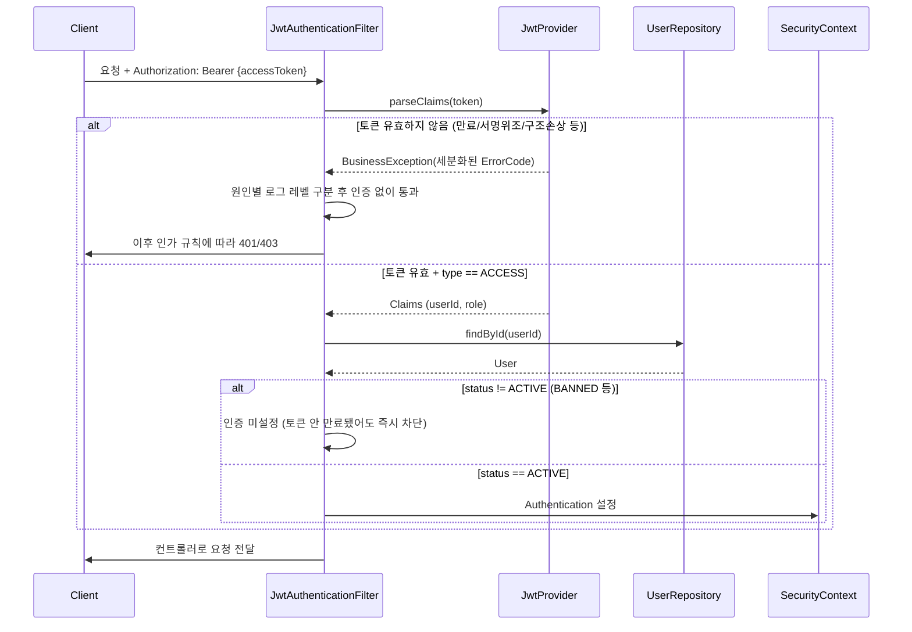
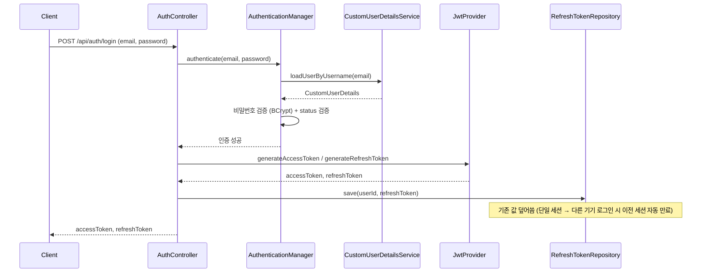
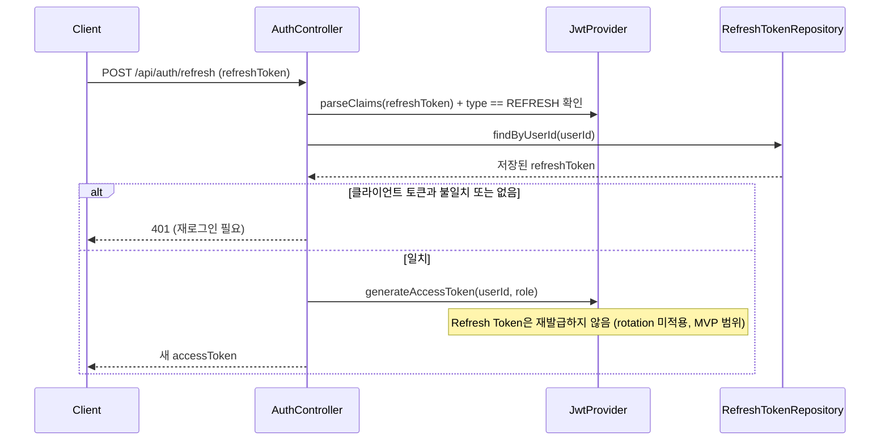
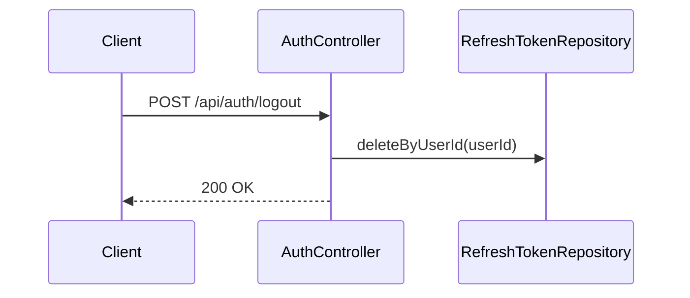

# 인증 아키텍처

> Phase 1: 인증 및 사용자 관리
> 서비스 초기 단계라 세부 구현(패키지 구조, 필드 설계 등)은 변경이 잦으므로 기록하지 않는다.
> 이 문서는 "왜 이런 구조를 선택했는지"와 "인증 흐름이 어떻게 동작하는지"만 정리한다.

---

## 1. 개요

JWT 기반 Stateless 인증. 서버는 세션을 유지하지 않고, 매 요청마다 클라이언트가 보낸 Access Token을 검증해 인증 여부를 판단한다.

| 구분 | 값 |
|------|-----|
| Access Token 만료 | 30분 |
| Refresh Token 만료 | 14일 |
| 서명 알고리즘 | HS256 |
| Refresh Token 저장소 | Redis, key `refresh:{userId}` (사용자당 1개, 단일 세션) |

**현재 구현 범위:** User 도메인, Spring Security 필터 체인, JWT 발급/검증 인프라(`JwtProvider`, `JwtAuthenticationFilter`, Refresh Token Redis 저장소)까지 완료. 회원가입/로그인/재발급/로그아웃 API는 다음 단계에서 구현 예정.

---

## 2. 요청 인증 흐름 (현재 구현됨)

모든 API 요청은 Spring Security 필터 체인을 통과하며, `JwtAuthenticationFilter`가 Access Token을 검증해 인증 정보를 설정한다.

**설계 포인트**

| 항목 | 결정 | 이유 |
|------|------|------|
| 인증 시 사용자 조회 | 매 요청마다 `userId`로 DB 조회 후 `CustomUserDetails` 생성 | 토큰 claim만으로 인증 객체를 만들면 BAN된 사용자가 Access Token 만료 전까지 계속 요청 가능해짐. DB 조회 비용은 MVP 단계에서 감수 |
| 토큰 검증 실패 처리 | 원인별 `ErrorCode` 세분화 (`EXPIRED_TOKEN`, `MALFORMED_TOKEN`, `INVALID_TOKEN_SIGNATURE`, `UNSUPPORTED_TOKEN`, `EMPTY_TOKEN`, `INVALID_TOKEN`) | 단순 boolean 반환은 서명 위조 시도와 단순 만료를 구분 못 해 보안 로그/모니터링에 불리함. 만료·빈 토큰은 `DEBUG`(정상 흐름), 위변조 의심 케이스는 `WARN` |
| 필터 실패 시 응답 | 예외를 던지지 않고 인증 미설정 상태로 다음 필터 통과 | `@RestControllerAdvice`는 필터 단계 예외를 못 잡으므로, 인증 실패는 이후 `authorizeHttpRequests` 규칙이 401/403으로 자연스럽게 처리하도록 위임 |

---

## 3. 로그인 흐름 (예정)

---

## 4. 토큰 재발급 흐름 (예정)

---

## 5. 로그아웃 흐름 (예정)

---

## 6. 컴포넌트 역할

| 컴포넌트 | 역할 |
|----------|------|
| `User` | 인증 주체 도메인. 이메일/비밀번호(BCrypt)/닉네임/권한(role)/상태(status)를 가짐 |
| `CustomUserDetails` | `User`를 Spring Security의 `UserDetails`로 감싸는 어댑터 (도메인이 Security에 직접 종속되지 않도록 분리) |
| `CustomUserDetailsService` | 이메일로 `User`를 조회해 `CustomUserDetails`로 변환 |
| `JwtProvider` | 토큰 발급(`generateAccessToken`/`generateRefreshToken`) 및 검증(`parseClaims`) 담당 |
| `JwtProperties` | `jwt.*` yml 설정을 `@ConfigurationProperties` + `@Validated`로 타입 안전하게 바인딩 (기동 시점에 값 누락/음수 만료시간 검증) |
| `JwtAuthenticationFilter` | 매 요청마다 Access Token을 검증해 `SecurityContext`에 인증 정보 설정 |
| `RefreshTokenRepository` | Redis 기반 Refresh Token 저장소 (`refresh:{userId}` 단일 세션) |
| `SecurityConfig` | 필터 체인 조립 + URI별 접근 제어 규칙 정의 |

---

## 7. 접근 제어 매트릭스

| URI 패턴 | GET | POST | PUT | DELETE |
|----------|-----|------|-----|--------|
| `/api/auth/**` | 허용 | 허용 | 허용 | 허용 |
| `/api/recipes/**` | 허용 | 인증 | 인증 | 인증 |
| `/api/foods/**` | 허용 | 인증 | 인증 | 인증 |
| `/api/users/me/**` | 인증 | 인증 | 인증 | 인증 |
| `/api/admin/**` | ADMIN | ADMIN | ADMIN | ADMIN |
| `/v3/api-docs/**`, `/swagger-ui/**` | 허용 | — | — | — |

---

## 8. 그 외 아키텍처 결정

| 항목 | 결정 | 이유 |
|------|------|------|
| CSRF | `disable()` | Stateless JWT 방식에서는 세션 쿠키가 없으므로 CSRF 공격 벡터가 없음 |
| Session | `STATELESS` | 서버 세션 미사용, JWT로 상태 관리 |
| Refresh Token rotation | 미적용 (재발급 시 Access Token만 새로 발급) | 구현 단순화를 위한 MVP 범위 결정. 필요 시 이후 확장 |
| Secret 관리 | local은 yml에 직접 기재, prod는 `${JWT_SECRET}` 환경변수 | 기존 DB 접속 정보(`DB_URL` 등)와 동일한 패턴 |
| `UserDetails` 구현 | `User`가 직접 구현하지 않고 어댑터(`CustomUserDetails`)로 분리 | 도메인 객체를 Spring Security에 종속시키지 않기 위함 |
